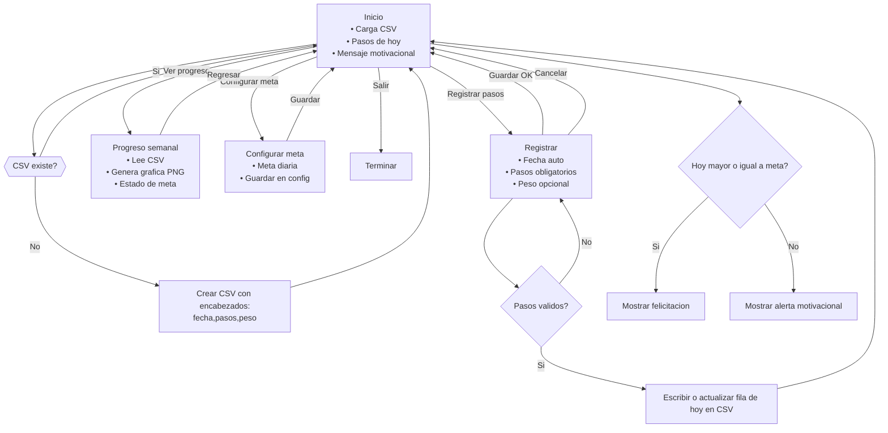

## Resumen del problema y criterios de éxito

En México, muchos adultos mayores no cumplen con la actividad física mínima recomendada por la OMS porque las aplicaciones disponibles son complejas, están en inglés o requieren dispositivos costosos. Esto limita su capacidad de registrar y monitorear su progreso, reduciendo su motivación y afectando su salud y autonomía.

Nuestro prototipo busca ofrecer una herramienta simple y accesible para que los adultos mayores puedan registrar manualmente sus pasos y peso, visualizar su avance con gráficas claras y recibir mensajes motivacionales que los animen a mantenerse activos.

Criterios de éxito:

El usuario puede registrar sus pasos y peso fácilmente sin ayuda externa.

La aplicación guarda la información de manera persistente y la muestra en una gráfica semanal clara.

Se envían alertas motivacionales cuando no se alcanzan los pasos recomendados.

La experiencia es amigable y accesible para adultos mayores con poca experiencia tecnológica.

ODS relacionado: ODS 3 – Salud y Bienestar, fomentando hábitos saludables y actividad física accesible para adultos mayores.**1. Seis posibles soluciones al problema**

- App móvil simplificada con conteo de pasos manual
 Una app donde el adulto mayor pueda registrar sus pasos y peso de forma sencilla, sin depender de sensores ni wearables.

- Pedometer físico + app con interfaz amigable
 Integrar un podómetro sencillo (dispositivo) que sincronice automáticamente los datos con la aplicación.

- Aplicación con acompañamiento familiar
 La app permite que un familiar reciba notificaciones del progreso y pueda motivar al adulto mayor.

- Gamificación ligera (metas semanales y logros)
 Se generan medallas o mensajes motivacionales al cumplir con pasos semanales.

- App de retos comunitarios
 Conectar a adultos mayores de una comunidad para que participen en metas grupales (“caminar juntos 100,000 pasos en la semana”).

- Asistente de voz integrado
 Funcionalidad para registrar pasos y recibir retroalimentación a través de comandos de voz (para quienes no leen bien o tienen problemas de visión).

**2. Selección de la idea base para el MVP**
La idea elegida es la App móvil simplificada con conteo de pasos manual y visualización clara del progreso, porque:
- ODS relacionado: ODS 3 (Salud y Bienestar).

- Población objetivo: Adultos mayores en México con poco acceso a apps complejas.

- Criterios de éxito: Registro fácil, visualización simple, persistencia de datos, alertas motivacionales.

Clasificación MoSCoW para el MVP:
- Must (indispensable):

Registro manual de pasos y peso.

Guardado de datos en archivo CSV.

Visualización de gráfica semanal clara y comprensible.

Alertas motivacionales si no cumplen los 7,000 pasos.

- Should (importante, pero no crítico en el MVP):

Mensajes de felicitación cuando se cumple la meta.

Posibilidad de editar registros anteriores.

- Could (deseable, pero no necesario en el MVP):

Interfaz de voz o lectura automática de pasos desde un wearable.

Retos comunitarios o familiares.

- Won’t (no se incluye en MVP):

Integración con redes sociales.

Sincronización en la nube.

División de módulos
app/

 Contendrá la interfaz hecha en PySimpleGUI (ventanas para registrar datos y mostrar gráficas).

core/

 Lógica de negocio: validación de datos, cálculo de metas, generación de mensajes motivacionales.

api/

 Futuro módulo (para MVP se deja vacío o simulado) que conectaría con podómetros o APIs externas si se quisiera extender.

viz/

 Uso de matplotlib para generar gráficas semanales claras y coloridas.

data/

 Lectura y escritura de datos en CSV (guardar pasos y peso, recuperar historial).

