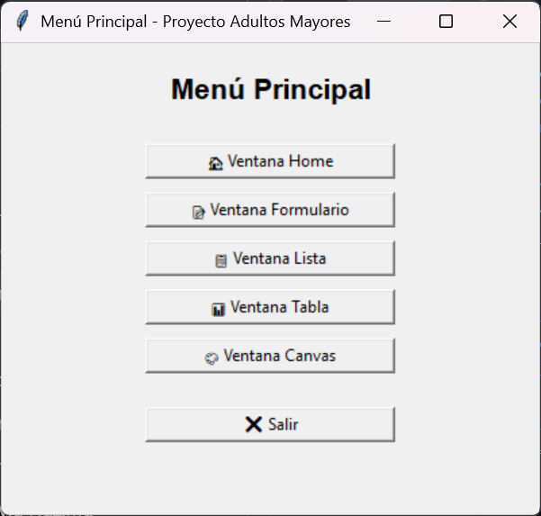

#liam Minihan Aguirre
Creé la ventana principal (menú) con tkinter (no requiere librerías externas).
-Agregué 6 botones:
Home
Formulario
Lista
Tabla
Canvas
salir
-Cada botón abre una subventana (Toplevel) con un mensaje diferente, para que cada integrante pueda personalizar su parte.
-En la ventana Canvas, programé un ejemplo con un rectángulo azul para mostrar cómo usar gráficos simples en tkinter.
-Implementé el botón Salir, que cierra toda la aplicación.
#main.py
import tkinter as tk
import sys

class MainApp(tk.Tk):
    def __init__(self):
        super().__init__()

        self.title("Menú Principal - Proyecto Adultos Mayores")
        self.geometry("400x350")
        self.configure(bg="#f0f0f0")

        # Etiqueta de título
        lbl_title = tk.Label(
            self,
            text="Menú Principal",
            font=("Arial", 16, "bold"),
            bg="#f0f0f0"
        )
        lbl_title.pack(pady=20)

        # Botones para abrir cada ventana
        btn_home = tk.Button(self, text="🏠 Ventana Home", width=25, command=self.open_home)
        btn_form = tk.Button(self, text="📝 Ventana Formulario", width=25, command=self.open_form)
        btn_list = tk.Button(self, text="📋 Ventana Lista", width=25, command=self.open_list)
        btn_table = tk.Button(self, text="📊 Ventana Tabla", width=25, command=self.open_table)
        btn_canvas = tk.Button(self, text="🎨 Ventana Canvas", width=25, command=self.open_canvas)
        btn_exit = tk.Button(self, text="❌ Salir", width=25, command=self.quit_app)

        # Empaquetar botones
        btn_home.pack(pady=5)
        btn_form.pack(pady=5)
        btn_list.pack(pady=5)
        btn_table.pack(pady=5)
        btn_canvas.pack(pady=5)
        btn_exit.pack(pady=20)

    # Métodos que abren ventanas simples
    def open_home(self):
        self.new_window("Home", "Bienvenido a la ventana Home")

    def open_form(self):
        self.new_window("Formulario", "Aquí va el registro de pasos y peso")

    def open_list(self):
        self.new_window("Lista", "Aquí se mostrará la lista de datos")

    def open_table(self):
        self.new_window("Tabla", "Aquí irá la tabla con información")

    def open_canvas(self):
        win = tk.Toplevel(self)
        win.title("Canvas")
        win.geometry("300x200")
        canvas = tk.Canvas(win, width=200, height=150, bg="white")
        canvas.pack(pady=20)
        canvas.create_rectangle(50, 50, 150, 100, fill="skyblue")
        tk.Label(win, text="Ejemplo de Canvas").pack()

    def new_window(self, title, message):
        win = tk.Toplevel(self)
        win.title(title)
        win.geometry("300x200")
        lbl = tk.Label(win, text=message, font=("Arial", 12))
        lbl.pack(pady=40)

    def quit_app(self):
        self.destroy()
        sys.exit()

if __name__ == "__main__":
    app = MainApp()
    app.mainloop()
