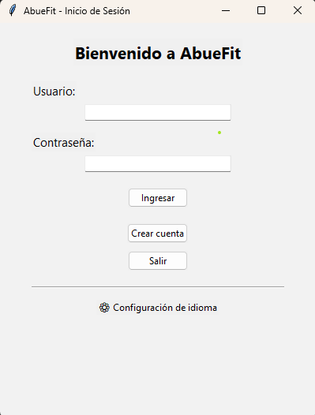

Integrante y ventana asignada

David Alejandro Hernández Muñoz
Ventana asignada: Pantalla de inicio de sesión (Home / Login) de AbueFit

Lista de cambios realizados

Eliminé la ventana inicial que solo servía para abrir la app y ahora la aplicación abre directamente en la pantalla de inicio de sesión.

Diseñé una interfaz sencilla con los campos de Usuario y Contraseña para que el inicio sea fácil de entender.

Agregué botones prácticos:

Ingresar: revisa que los campos estén llenos y da un mensaje de bienvenida.

Crear cuenta: por ahora muestra un aviso, pero está pensado para registrar nuevos usuarios después.

Salir: cierra la aplicación rápidamente.

Añadí una pequeña sección de ⚙ Configuración de idioma para que sea fácil cambiar el idioma si se necesita.

Incorporé el logo y el nombre “AbueFit” para darle identidad visual y que sea más agradable y reconocible.

Captura de pantalla de la ventana

(Aquí puedes poner la captura que ya tomaste de la ventana funcionando.)

Reflexión personal

Quise que esta ventana fuera clara y sencilla para los adultos mayores, que son nuestro público principal.
Me pareció importante que no hubiera pasos extra antes de llegar al inicio de sesión, porque eso puede confundir a alguien que no está tan acostumbrado a la tecnología. También agregué el botón de Crear cuenta, aunque sea básico por ahora, porque creo que en un futuro ayudará a que nuevos usuarios puedan registrarse fácilmente.

La sección de idioma y el logo le dan un toque más profesional y accesible, haciéndola más amigable y confiable.
Creo que con estos cambios logramos que la aplicación sea simple y cercana, para que los abuelitos se sientan cómodos usándola y puedan enfocarse en lo importante: registrar su actividad y mantenerse activos para mejorar su salud.

import tkinter as tk
from tkinter import ttk, messagebox

def open_win_login():
    # Crear ventana principal directamente
    win = tk.Tk()
    win.title("AbueFit - Inicio de Sesión")
    win.geometry("400x500")
    win.config(bg="#f2f2f2")  # color de fondo claro

    # ---- Título ----
    ttk.Label(win, text="Bienvenido a AbueFit", font=("Segoe UI", 16, "bold")).pack(pady=(20,10))

    # ---- Usuario ----
    ttk.Label(win, text="Usuario:", font=("Segoe UI", 11)).pack(anchor="w", padx=40, pady=(10,0))
    entry_user = ttk.Entry(win, width=30)
    entry_user.pack(padx=40, pady=5)

    # ---- Contraseña ----
    ttk.Label(win, text="Contraseña:", font=("Segoe UI", 11)).pack(anchor="w", padx=40, pady=(10,0))
    entry_pass = ttk.Entry(win, show="*", width=30)
    entry_pass.pack(padx=40, pady=5)

    # ---- Botones ----
    def login_action():
        user = entry_user.get()
        pw = entry_pass.get()
        if user and pw:
            messagebox.showinfo("AbueFit", f"¡Bienvenido, recuerda que hoy será un dia excelente! {user}!")
        else:
            messagebox.showwarning("Error", "Por favor, ingresa usuario y contraseña")

    ttk.Button(win, text="Ingresar", command=login_action).pack(pady=15)
    ttk.Button(win, text="Crear cuenta", command=lambda: messagebox.showinfo("Crear cuenta", "Función no implementada")).pack(pady=5)
    ttk.Button(win, text="Salir", command=win.destroy).pack(pady=5)

    # ---- Configuración idioma ----
    ttk.Separator(win, orient="horizontal").pack(fill="x", padx=40, pady=15)
    ttk.Label(win, text="⚙ Configuración de idioma", font=("Segoe UI", 9)).pack()

    win.mainloop()

if __name__ == "__main__":
    open_win_login()

