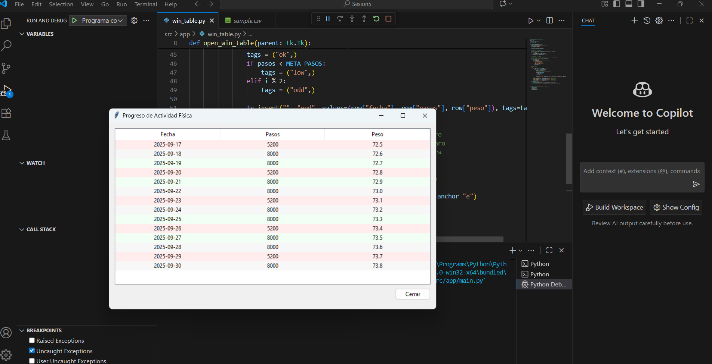

Nombre del integrante y ventana asignada

Integrante: Luis Gabriel Aranda Torres

Ventana asignada: win_table.py (Tabla)

Lista de cambios aplicados a la ventana

Cambié las columnas originales (nombre, valor1, valor2) por las que necesita nuestro proyecto: fecha, pasos, peso.

Implementé que la ventana lea y escriba en el archivo src/data/health_log.csv, que guarda los registros de actividad.

Hice que el programa cree automáticamente un CSV de ejemplo si no existe, para que la tabla siempre tenga datos y no marque error.

Añadí un sistema de colores:

Rojo claro → cuando los pasos son menores a 7000 (alerta).

Verde claro → cuando los pasos son mayores o iguales a 7000 (meta cumplida).

Gris claro → para alternar filas y mejorar la legibilidad.

Ajusté el tamaño de la ventana y las columnas para que la información sea clara y visible.

Breve reflexión

Estos cambios apoyan la idea del proyecto porque permiten a un adulto mayor (nuestro usuario objetivo) visualizar fácilmente si cumplió con la meta diaria de pasos. El uso de colores simples y claros evita confusiones y da retroalimentación inmediata, mientras que los datos de fecha, pasos y peso son justamente la información que buscamos registrar en el MVP.
De esta forma, la ventana de tabla se convierte en una herramienta accesible y motivadora para que los usuarios puedan monitorear su progreso físico, en línea con el ODS 3: Salud y Bienestar.
