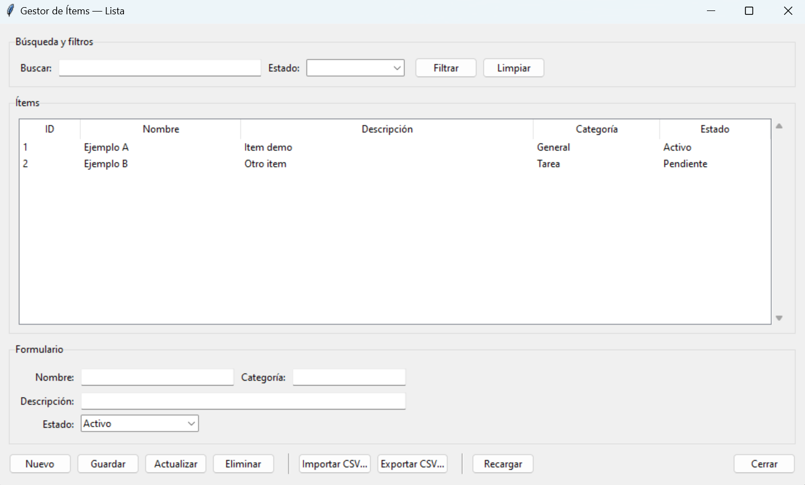

Mauricio Zermeño win_list.py
# /src/app/win_list.py
import csv
from pathlib import Path
import tkinter as tk
from tkinter import ttk, messagebox, filedialog

# --------- Configuración de almacenamiento ----------
REPO_ROOT = Path(__file__).resolve().parents[2]
DATA_DIR = REPO_ROOT / "data"
DATA_DIR.mkdir(parents=True, exist_ok=True)
CSV_PATH = DATA_DIR / "items.csv"

COLUMNS = ["id", "nombre", "descripcion", "categoria", "estado"]

DEFAULT_ROWS = [
    {"id": "1", "nombre": "Ejemplo A", "descripcion": "Item demo", "categoria": "General", "estado": "Activo"},
    {"id": "2", "nombre": "Ejemplo B", "descripcion": "Otro item", "categoria": "Tarea", "estado": "Pendiente"},
]

# --------- Utilidades CSV ----------
def ensure_csv_exists():
    if not CSV_PATH.exists():
        with open(CSV_PATH, "w", newline="", encoding="utf-8") as f:
            writer = csv.DictWriter(f, fieldnames=COLUMNS)
            writer.writeheader()
            writer.writerows(DEFAULT_ROWS)

def load_rows():
    ensure_csv_exists()
    with open(CSV_PATH, "r", newline="", encoding="utf-8") as f:
        reader = csv.DictReader(f)
        return [row for row in reader]

def save_rows(rows):
    with open(CSV_PATH, "w", newline="", encoding="utf-8") as f:
        writer = csv.DictWriter(f, fieldnames=COLUMNS)
        writer.writeheader()
        for r in rows:
            writer.writerow(r)

def next_id(rows):
    if not rows:
        return "1"
    try:
        return str(max(int(r["id"]) for r in rows) + 1)
    except Exception:
        return str(len(rows) + 1)

# --------- Ventana principal de la lista ----------
class ListWindow(tk.Toplevel):
    def __init__(self, master=None):
        super().__init__(master)
        self.title("Gestor de Ítems — Lista")
        self.geometry("980x560")
        self.minsize(900, 520)
        self.configure(padx=14, pady=14)

        self.rows = load_rows()
        self.selected_id = None

        self._build_search_bar()
        self._build_table()
        self._build_form()
        self._build_actions()

        self._refresh_table()

    # ---------- UI ----------
    def _build_search_bar(self):
        frame = ttk.LabelFrame(self, text="Búsqueda y filtros", padding=10)
        frame.pack(fill="x", pady=(0, 10))

        ttk.Label(frame, text="Buscar:").grid(row=0, column=0, sticky="w")
        self.var_search = tk.StringVar()
        ent = ttk.Entry(frame, textvariable=self.var_search, width=40)
        ent.grid(row=0, column=1, padx=6)
        ent.bind("<Return>", lambda e: self._apply_filters())

        ttk.Label(frame, text="Estado:").grid(row=0, column=2, sticky="e")
        self.var_estado_filter = tk.StringVar()
        cmb = ttk.Combobox(
            frame,
            textvariable=self.var_estado_filter,
            values=["", "Activo", "Pendiente", "Inactivo"],
            width=16,
            state="readonly",
        )
        cmb.grid(row=0, column=3, padx=6)
        cmb.bind("<<ComboboxSelected>>", lambda e: self._apply_filters())

        ttk.Button(frame, text="Filtrar", command=self._apply_filters).grid(row=0, column=4, padx=6)
        ttk.Button(frame, text="Limpiar", command=self._clear_filters).grid(row=0, column=5)

    def _build_table(self):
        frame = ttk.LabelFrame(self, text="Ítems", padding=10)
        frame.pack(fill="both", expand=True)

        columns = ("id", "nombre", "descripcion", "categoria", "estado")
        self.tree = ttk.Treeview(frame, columns=columns, show="headings", selectmode="browse")

        headings = {
            "id": "ID",
            "nombre": "Nombre",
            "descripcion": "Descripción",
            "categoria": "Categoría",
            "estado": "Estado",
        }
        widths = {"id": 60, "nombre": 180, "descripcion": 340, "categoria": 140, "estado": 120}
        for col in columns:
            self.tree.heading(col, text=headings[col])
            self.tree.column(col, width=widths[col], anchor="w")

        vsb = ttk.Scrollbar(frame, orient="vertical", command=self.tree.yview)
        self.tree.configure(yscrollcommand=vsb.set)

        self.tree.pack(side="left", fill="both", expand=True)
        vsb.pack(side="right", fill="y")

        self.tree.bind("<<TreeviewSelect>>", self._on_select)

    def _build_form(self):
        frame = ttk.LabelFrame(self, text="Formulario", padding=10)
        frame.pack(fill="x", pady=(10, 10))

        self.var_nombre = tk.StringVar()
        self.var_descripcion = tk.StringVar()
        self.var_categoria = tk.StringVar()
        self.var_estado = tk.StringVar(value="Activo")

        ttk.Label(frame, text="Nombre:").grid(row=0, column=0, sticky="e")
        ttk.Entry(frame, textvariable=self.var_nombre, width=30).grid(row=0, column=1, padx=6, pady=4, sticky="we")

        ttk.Label(frame, text="Categoría:").grid(row=0, column=2, sticky="e")
        ttk.Entry(frame, textvariable=self.var_categoria, width=22).grid(row=0, column=3, padx=6, pady=4, sticky="we")

        ttk.Label(frame, text="Descripción:").grid(row=1, column=0, sticky="e")
        ttk.Entry(frame, textvariable=self.var_descripcion).grid(row=1, column=1, columnspan=3, padx=6, pady=4, sticky="we")

        ttk.Label(frame, text="Estado:").grid(row=2, column=0, sticky="e")
        ttk.Combobox(
            frame,
            textvariable=self.var_estado,
            values=["Activo", "Pendiente", "Inactivo"],
            state="readonly",
            width=20,
        ).grid(row=2, column=1, sticky="w", padx=6, pady=(2, 4))

    def _build_actions(self):
        frame = ttk.Frame(self)
        frame.pack(fill="x")

        ttk.Button(frame, text="Nuevo", command=self._action_new).pack(side="left")
        ttk.Button(frame, text="Guardar", command=self._action_save).pack(side="left", padx=6)
        ttk.Button(frame, text="Actualizar", command=self._action_update).pack(side="left")
        ttk.Button(frame, text="Eliminar", command=self._action_delete).pack(side="left", padx=6)

        ttk.Separator(frame, orient="vertical").pack(side="left", fill="y", padx=10)
        ttk.Button(frame, text="Importar CSV…", command=self._action_import).pack(side="left")
        ttk.Button(frame, text="Exportar CSV…", command=self._action_export).pack(side="left", padx=6)

        ttk.Separator(frame, orient="vertical").pack(side="left", fill="y", padx=10)
        ttk.Button(frame, text="Recargar", command=self._refresh_from_disk).pack(side="left")
        ttk.Button(frame, text="Cerrar", command=self.destroy).pack(side="right")

    # ---------- Lógica ----------
    def _refresh_from_disk(self):
        self.rows = load_rows()
        self._refresh_table()
        self._clear_form()
        messagebox.showinfo("Recargado", "Datos recargados desde /data/items.csv.")

    def _refresh_table(self, filtered=None):
        for i in self.tree.get_children():
            self.tree.delete(i)
        data = filtered if filtered is not None else self.rows
        for r in data:
            self.tree.insert("", "end", iid=r["id"], values=(r["id"], r["nombre"], r["descripcion"], r["categoria"], r["estado"]))

    def _clear_form(self):
        self.selected_id = None
        self.var_nombre.set("")
        self.var_descripcion.set("")
        self.var_categoria.set("")
        self.var_estado.set("Activo")

    def _on_select(self, _event=None):
        cur = self.tree.selection()
        if not cur:
            return
        iid = cur[0]
        self.selected_id = iid
        row = next((r for r in self.rows if r["id"] == iid), None)
        if row:
            self.var_nombre.set(row["nombre"])
            self.var_descripcion.set(row["descripcion"])
            self.var_categoria.set(row["categoria"])
            self.var_estado.set(row["estado"])

    def _apply_filters(self):
        q = (self.var_search.get() or "").strip().lower()
        est = (self.var_estado_filter.get() or "").strip()
        def ok(r):
            text = " ".join([r["nombre"], r["descripcion"], r["categoria"], r["estado"]]).lower()
            if q and q not in text:
                return False
            if est and r["estado"] != est:
                return False
            return True
        filtered = [r for r in self.rows if ok(r)]
        self._refresh_table(filtered)

    def _clear_filters(self):
        self.var_search.set("")
        self.var_estado_filter.set("")
        self._refresh_table()

    # ---- CRUD ----
    def _action_new(self):
        self._clear_form()
        self.tree.selection_remove(self.tree.selection())

    def _action_save(self):
        nombre = self.var_nombre.get().strip()
        if not nombre:
            messagebox.showwarning("Falta nombre", "El campo 'Nombre' es obligatorio.")
            return
        new_row = {
            "id": next_id(self.rows),
            "nombre": nombre,
            "descripcion": self.var_descripcion.get().strip(),
            "categoria": self.var_categoria.get().strip() or "General",
            "estado": self.var_estado.get().strip() or "Activo",
        }
        self.rows.append(new_row)
        save_rows(self.rows)
        self._refresh_table()
        self.tree.selection_set(new_row["id"])
        messagebox.showinfo("Guardado", f"Ítem '{nombre}' agregado.")

    def _action_update(self):
        if not self.selected_id:
            messagebox.showwarning("Sin selección", "Selecciona un ítem de la tabla.")
            return
        for r in self.rows:
            if r["id"] == self.selected_id:
                r["nombre"] = self.var_nombre.get().strip()
                r["descripcion"] = self.var_descripcion.get().strip()
                r["categoria"] = self.var_categoria.get().strip()
                r["estado"] = self.var_estado.get().strip()
                break
        save_rows(self.rows)
        self._refresh_table()
        self.tree.selection_set(self.selected_id)
        messagebox.showinfo("Actualizado", "El ítem seleccionado fue actualizado.")

    def _action_delete(self):
        if not self.selected_id:
            messagebox.showwarning("Sin selección", "Selecciona un ítem de la tabla.")
            return
        if not messagebox.askyesno("Confirmar", "¿Eliminar el ítem seleccionado?"):
            return
        self.rows = [r for r in self.rows if r["id"] != self.selected_id]
        save_rows(self.rows)
        self._refresh_table()
        self._clear_form()
        messagebox.showinfo("Eliminado", "Ítem eliminado.")

    # ---- Import/Export ----
    def _action_import(self):
        path = filedialog.askopenfilename(
            title="Importar CSV",
            filetypes=[("CSV files", "*.csv")],
        )
        if not path:
            return
        try:
            with open(path, "r", newline="", encoding="utf-8") as f:
                reader = csv.DictReader(f)
                rows = []
                for i, r in enumerate(reader, start=1):
                    row = {c: (r.get(c) or "").strip() for c in COLUMNS}
                    row["id"] = row["id"] or str(i)
                    rows.append(row)
            self.rows = rows
            save_rows(self.rows)
            self._refresh_table()
            self._clear_form()
            messagebox.showinfo("Importado", "Datos importados y guardados en /data/items.csv.")
        except Exception as e:
            messagebox.showerror("Error al importar", str(e))

    def _action_export(self):
        path = filedialog.asksaveasfilename(
            title="Exportar CSV",
            defaultextension=".csv",
            filetypes=[("CSV files", "*.csv")],
            initialfile="items_export.csv",
        )
        if not path:
            return
        try:
            with open(path, "w", newline="", encoding="utf-8") as f:
                writer = csv.DictWriter(f, fieldnames=COLUMNS)
                writer.writeheader()
                for r in self.rows:
                    writer.writerow(r)
            messagebox.showinfo("Exportado", f"CSV exportado a:\n{path}")
        except Exception as e:
            messagebox.showerror("Error al exportar", str(e))

# --------- API pública ----------
def open_window(master: tk.Misc):
    return ListWindow(master)

# Alias para compatibilidad con main.py
def open_win_list(master: tk.Misc):
    return open_window(master)
    
    
